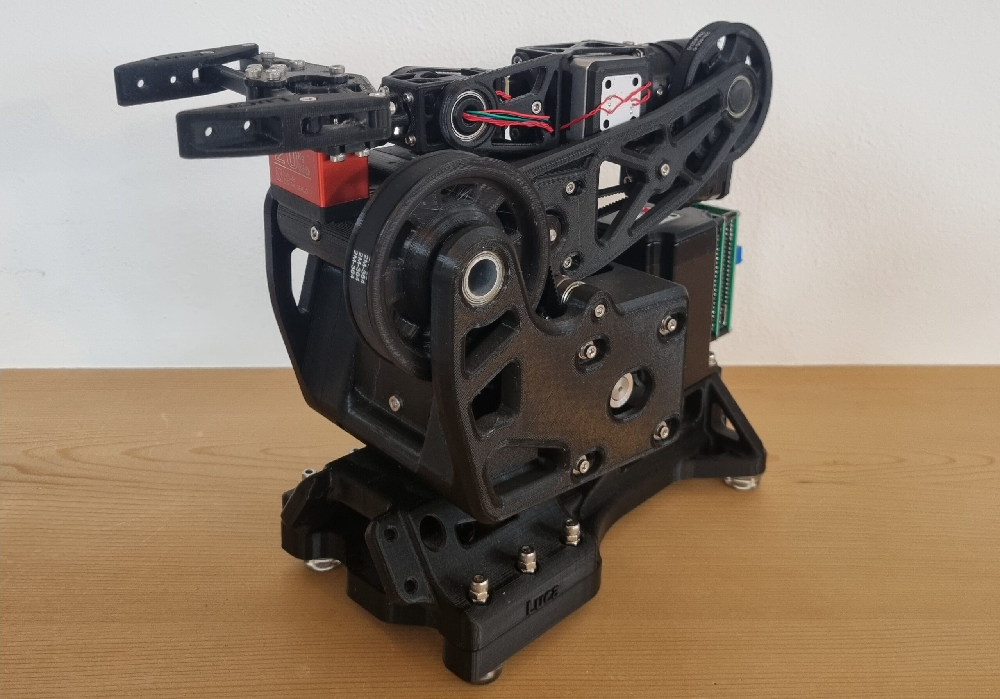
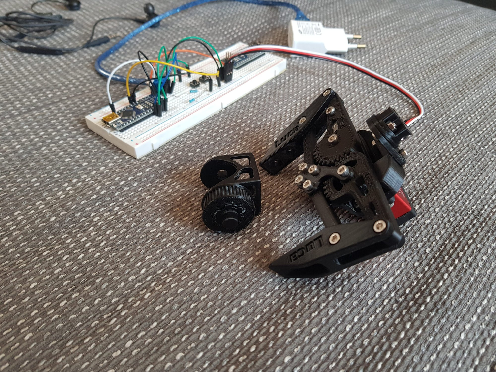
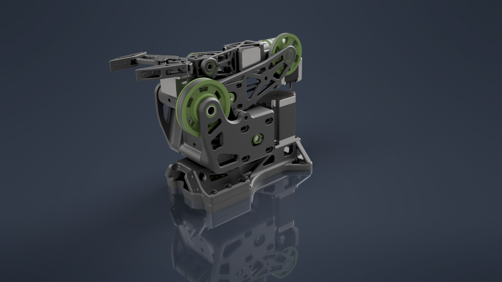
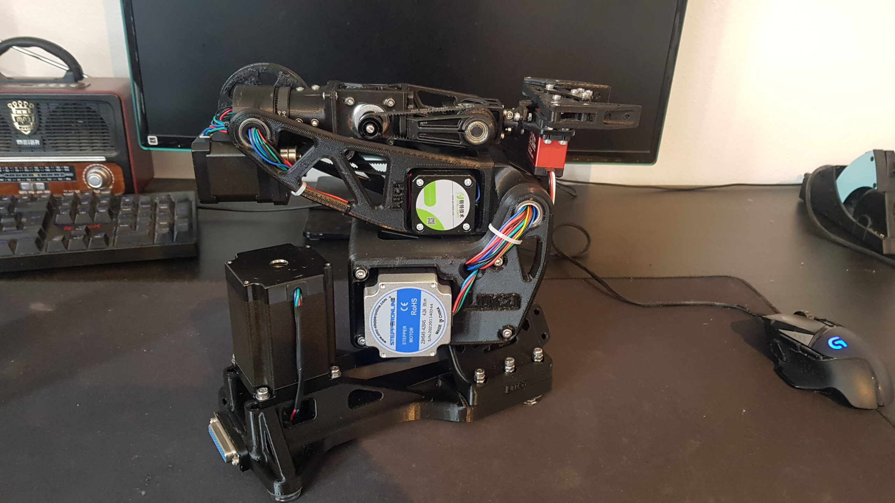
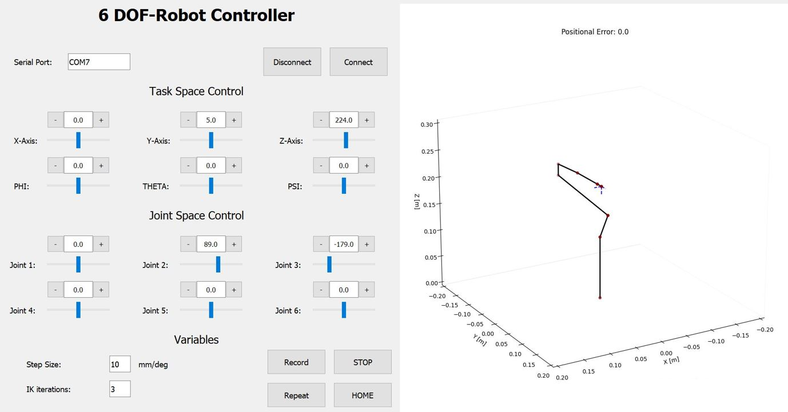
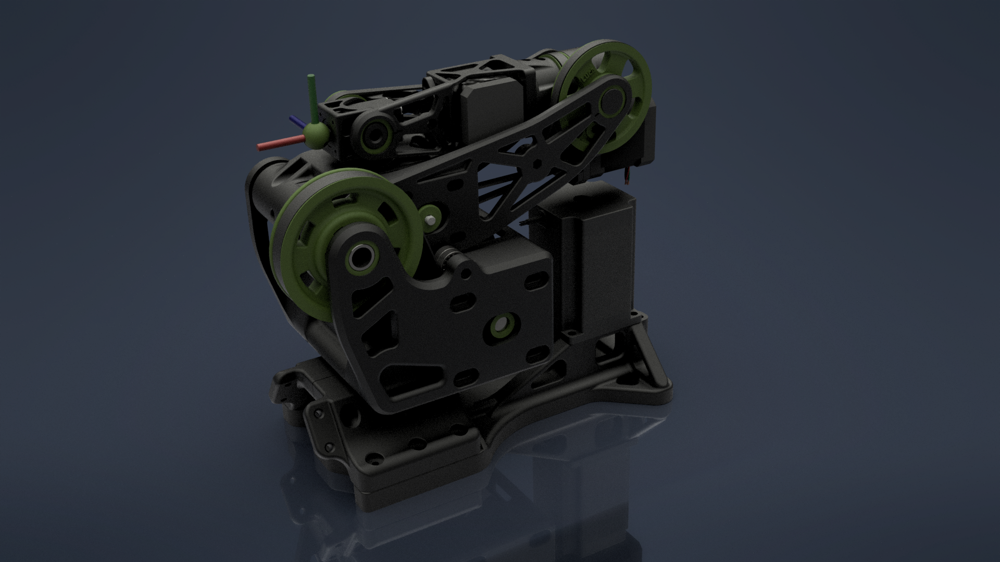
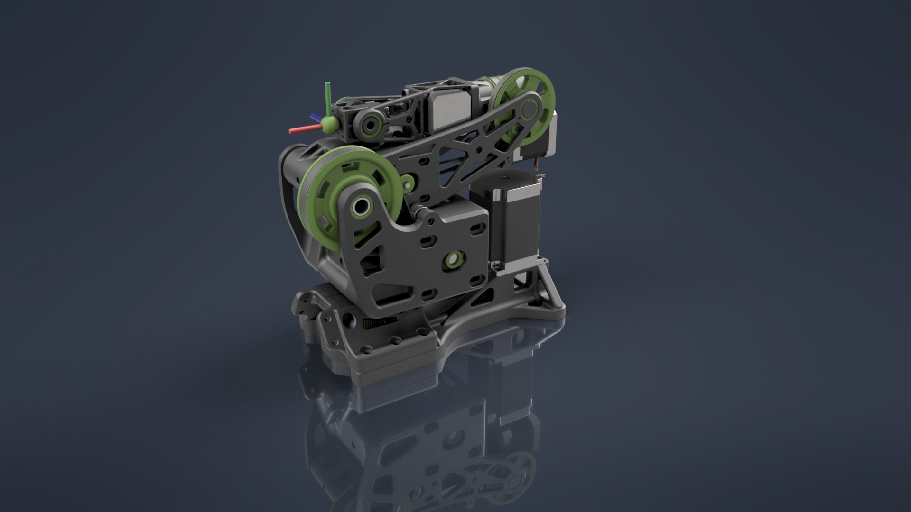

# 6-DOF Robotic Arm

A six-axis 3D-printed stepper arm inspired by the ABB IRB 1100. This repository contains a legacy
serial desktop controller, six-axis step-count firmware, encoder/FOC experiments, and a ROS 2
keyboard publisher. The ROS 2 publisher is not connected to the Arduino firmware in this repo.



## Overview

This repository documents the full software stack behind the arm, from the low-level Arduino
firmware up to the operator GUI and ROS teleoperation. Each part of the stack lives in its own
top-level folder:

| Folder | What it is |
|---|---|
| [`python_gui/`](python_gui/) | Legacy PyQt5 desktop GUI — serial joint/task-space targets, numerical IK, plotting, and encoder-based teach recording/replay |
| [`firmware/`](firmware/) | Arduino Mega 2560 step-count motion firmware plus encoder and single-axis control experiments |
| [`ros2/`](ros2/) | ROS 2 keyboard publisher for `sensor_msgs/JointState`; no in-repository device subscriber |
| [`ros1_legacy/`](ros1_legacy/) | Legacy ROS 1 teleop prototype, superseded by `ros2/` |
| [`docs/`](docs/) | Inverse kinematics derivation/notebook and README images |

## Features

- **Joint-space and task-space GUI controls** send six-axis step-count targets over serial to the
  Arduino Mega 2560. IK targets are plotted using the URDF chain.
- **Encoder-based teach recording** disables the steppers while recording six AS5600 joint readings
  over serial, then replays the recorded positions.
- **ROS 2 keyboard publisher** sends incremental joint targets on `/joint_commands`; JointState
  positions are in radians. This repository contains no subscriber or micro-ROS bridge that drives
  the Arduino from that topic.
- **Encoder and FOC experiments** cover encoder readout/filtering and a single-axis feasibility
  sketch. They do not establish a completed six-axis continuous-servo controller.

| | |
|---|---|
| **Started** | Early 2022 |
| **Inspired by** | ABB IRB 1100 |
| **Actuation** | 6x stepper motors |
| **Low-level control** | Arduino Mega 2560 step-count firmware |
| **Inverse kinematics** | Numerical IKPY in the legacy desktop GUI; DH derivation and MATLAB materials are under `docs/` |
| **Interfaces** | PyQt5 serial GUI; separate ROS 2 keyboard publisher |

## Implementation status

The following describes code present in this repository, not a claim of current hardware validation:

- The legacy GUI computes IK and sends six-axis step-count targets over a serial protocol.
- The six-axis firmware contains stepper target motion and serial encoder readings used by the
  manual teach-recording path. The source does not implement continuous six-axis encoder correction.
- Separate sketches explore single-axis encoder measurement/filtering and stepper FOC.
- The ROS 2 node publishes commands only. No ROS 2 subscriber or micro-ROS device bridge is present
  here, so the node by itself does not drive the arm.
- **Continuous six-axis closed-loop servo control is not documented as complete.**

The project start date remains **Early 2022**; no completion date is inferred from these source files.

## Coordinate and unit conventions

The IK target frame uses the right-handed `base_link` frame defined by
[`python_gui/arm_urdf.urdf`](python_gui/arm_urdf.urdf): GUI `x`, `y`, and `z` values are millimetres
along the corresponding URDF axes (`z` is the vertical axis), and the helper converts them directly
to metres without swapping axes. GUI orientation inputs `phi`, `theta`, and `psi` are degrees and
form `Rx(phi) @ Ry(theta) @ Rz(psi)`. IKPY joint values are radians; the serial firmware command
converts the GUI's model-joint values to its step-count target protocol. The GUI's IK budget setting
maps to IKPY 4.1's optimizer evaluation budget (default 100). ROS `JointState.position` values are
radians, not degrees.

## Repository layout

```
6-DOF-robot/
├── python_gui/                   # Desktop operator GUI (PyQt5 + IKPY) and the robot URDF
├── firmware/                     # Arduino sketches (stepper control, encoders, FOC test)
│   ├── multi_axis_stepper_accelstepper/
│   ├── multi_axis_stepper_flexystepper/
│   ├── axis6_encoder_test/
│   ├── single_axis_encoder_filter_test/
│   └── stepper_foc_test/
├── ros2/                         # ROS 2 keyboard JointState publisher
├── ros1_legacy/                  # Legacy ROS 1 task-space teleop prototype (reference only)
├── tests/                        # ROS-independent kinematics and teleop logic tests
├── docs/
│   ├── images/                   # Screenshots, build photos and CAD renders used in this README
│   └── inverse_kinematics/       # DH derivation (PDF), MATLAB scripts, IKPY demo notebook
├── LICENSE
└── README.md
```

## Python setup and tests

The desktop GUI dependencies are pinned in
[`python_gui/requirements.txt`](python_gui/requirements.txt). The versions are intended for Python
3.13; the generated Qt UI was produced with PyQt5 5.15.9 and is run with the compatible 5.15.11
binding.

On Windows, from the repository root:

```powershell
py -3.13 -m venv .venv
.\.venv\Scripts\Activate.ps1
python -m pip install -r python_gui/requirements.txt
cd python_gui
python main.py
```

The GUI opens the serial port configured in `main.py` (`COM7` by default), so update that setting
for the connected controller before launch. To run the kinematics and ROS command-logic tests
without hardware or a ROS installation, run this from the repository root after installing the
requirements:

```powershell
python -m unittest discover -s tests -v
```

The same unit-test command runs in GitHub Actions on Python 3.13.

> **Note on CAD/3D models:** the Inventor/SolidWorks source files, STL/STEP exports, and raw
> build photos & videos are maintained outside of this repository (they are large, binary, and not
> diff-friendly for git). A curated set of renders and photos is included under `docs/images/`, and
> the full gallery is available on the
> [project page](https://lucaobwegs.com/6-dof-robotic-arm/).

## Running the GUI

Use the pinned Python 3.13 setup above, then launch from `python_gui/`:

```bash
python main.py
```

On start-up the app connects to the Arduino Mega over the serial port configured in `main.py`
(`COM7` by default), loads `arm_urdf.urdf` for inverse kinematics, and opens the controller window
shown in the gallery below.

## Running the ROS 2 keyboard teleop node

Requires a ROS 2 installation that provides `rclpy` and `sensor_msgs` (for example, source the
Humble installation on Ubuntu):

```bash
source /opt/ros/humble/setup.bash
python3 ros2/keyboard_teleop.py --step 2.0 --rate 20
```

`q/a`, `w/s`, `e/d`, `r/f`, `t/g`, `y/h` jog joints 1–6, `SPACE` resets to the home position, and
`ESC`/`Ctrl+C` exits. Commands are published on `/joint_commands` as `sensor_msgs/JointState` with
positions in radians. This project does not include a subscriber or micro-ROS bridge to consume
these messages on the Arduino.

## Firmware

Arduino Mega 2560 sketches under [firmware/](firmware/), built with the Arduino IDE / arduino-cli:

| Sketch | Purpose |
|---|---|
| `multi_axis_stepper_accelstepper/` | Six-axis AccelStepper target motion; reads AS5600 values for the serial teach-recording path, not continuous position correction |
| `multi_axis_stepper_flexystepper/` | Earlier six-axis step/direction control using FlexyStepper's trapezoidal profiles |
| `axis6_encoder_test/` | Standalone axis-6 AS5600 and stepper experiment |
| `single_axis_encoder_filter_test/` | Single-axis position/velocity low-pass filter experiment |
| `stepper_foc_test/` | Single-axis field-oriented-control feasibility experiment (SimpleFOC) |

## Legacy components (kept for reference)

- **[`ros1_legacy/legacy_task_space_teleop.py`](ros1_legacy/legacy_task_space_teleop.py)** — an
  early ROS 1 task-space teleop script (adapted from the open-source `teleop_twist_keyboard`
  package), superseded by the ROS 2 node in `ros2/`.
- **[`docs/inverse_kinematics/`](docs/inverse_kinematics/)** — the Denavit–Hartenberg derivation
  (`inverse_kinematics_derivation.pdf`, `transformation_matrices_reference.jpg`), the MATLAB
  symbolic/numeric solution (`matlab/`), and an IKPY-based Jupyter notebook demo
  (`inverse_kinematics_demo.ipynb`).

## Gallery

| | |
|---|---|
|  |  |
|  |  |
|  |  |

More photos and build videos are available on the
[project page](https://lucaobwegs.com/6-dof-robotic-arm/).

## License

Distributed under the GNU General Public License v3.0 — see [LICENSE](LICENSE) for details.

## Author

**Luca Obwegs** — Control & Robotics Engineer
[lucaobwegs.com](https://lucaobwegs.com) · [GitHub](https://github.com/lgitrt) ·
[LinkedIn](https://www.linkedin.com/in/luca-obwegs-768716223)
